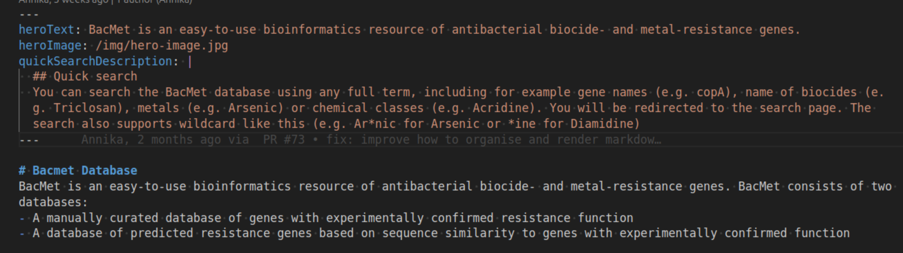
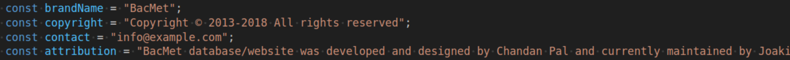

# How update text on static pages on BacMet website

This is a simple instruction on how to update text on the static pages of the Bacmet website using markdown.

Documentation on markdown: https://www.markdownguide.org/basic-syntax/

## Basic structures
The static pages are: 
- About
- Contact 
- Download
- FAQ
- Index (Homepage)

The markdown files can differ a little in terms of structure. Some of them have a section in the beginning that looks like this (the example below is the index.md used in the Homepage): 

The first section (within the ---) contains some metadata that will allow some special information to be rendered on the page. In the printscreen above it shows the text on top of the image on the Homepage, the path to the image and the description used in the Quick search-box on the homepage. Other places where this is used is the Contact-page and the FAQ-page. This information can also be altered but the structure needs to be the same. 

Other pages (like About-page) use no metadata and this works as a normal markdown file. 

## Metadata on FAQ-page and Contact-page
On the FAQ-page and the Contact-page the metadata consists of a list of objects. In the FAQ-page it's the questions and answers and on the Contact-page it's the contact information for the people in the Bacmet-project. Objects can be added and removed from these lists as you want, as long as the structure of the objects are the same.

## Images
You can add images to the markdown files, as long as you provide the path for that image in your markdown file. The images are stored in the img-folder (bacmet/frontend/bacmet/public/img). When you're adding a path to an image in the markdown file you can write: /img/image-name.jpg. This is of course as long as the folder structure stays the same. 

It can be good to know that some images are styled in specific way. The images on the index-page (Homepage) and the Contact-page have specific styling. In the Contact-page there is also fallback image (avatar.png) that will be added if there is no image added in the metadata and img-folder.

## Layout.tsx 
In the app-folder (bacmet/frontend/bacmet/app) there is a file called layout.tsx. This determines the rendering of the navbar and the footer. In the footer there is some information that you can alter if you want. The text that can be altered are brandname, copyright, contact e-mail, and attribution. See screenshot below. 

